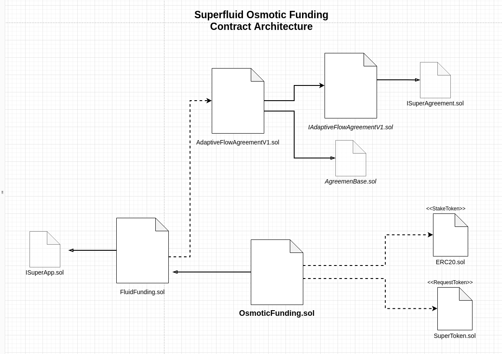

# Osmotic Funding

A protocol built on top of Superfluid Finance and Conviction Voting to create and regulate project funding streams based on the amount of interest a community has on them.

In Osmotic Funding, the funds allocation is based on community signaling via token staking so the community can determined the rate each proposal or project that is being funded by staking more or less tokens on it. Everytime a new staking or unstaking happens the rate varies over time until it reachs the new target rate or "equilibrium".


# 🏄‍♂️ Quick Start

Prerequisites: [Node](https://nodejs.org/en/download/) plus [Yarn](https://classic.yarnpkg.com/en/docs/install/) and [Git](https://git-scm.com/downloads)

> clone/fork:

```bash
git clone https://github.com/BlossomLabs/osmotic-funding.git
```

> install and start 👷‍ Hardhat chain:

```bash
cd osmotic-funding
yarn install
yarn fork
```

> in a second terminal window, start 📱 frontend:

```bash
cd osmotic-funding
yarn start
```

> in a third terminal window, 🛰 deploy contracts:

```bash
cd osmotic-funding
yarn deploy
```

📱 Open http://localhost:3000 to see the app.

## Superfluid integration: Adaptive Flow Agreement V1

In order to have changing flow rates over time for our funding streams we have implemented a Superfluid agreement (a first version at least) called **Adaptive Flow**. This advanced feature integrates with the protocol and allows us to create more sophisticated payment flows following exponential decay/growth formulas to calculate the flows and balance at any given point of time.

> checkout the `superfluid-osmotic-funding` branch to play with it:

```bash
git checkout superfluid-osmotic-funding
```

## Contract Architecture

Below you can find an overview of the Osmotic Funding Contract Architecture that uses Superfluid underneath:


